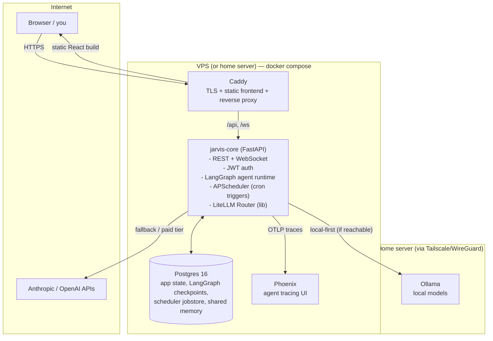

# Jarvis — Architecture Overview (Deliverable 1)

Self-hosted, Dockerized multi-agent environment. One compose stack, portable
between a Hostinger VPS and a home server by moving volumes and repointing DNS.

## 1. Component map

No message bus, no Redis, no Celery. One long-running Python process hosts the
API, the scheduler, and agent execution (as asyncio tasks). That is deliberate:
single user, modest VPS, boring and debuggable. If agent runs ever get heavy
enough to starve the API, the escape hatch is splitting a `jarvis-worker`
container that shares the same codebase and Postgres — a compose change, not a
rearchitecture.

## 2. Containers

| Container | Image / basis | Role | RAM (approx) |
|---|---|---|---|
| `caddy` | caddy:2 | TLS (Let's Encrypt), serves React build, proxies `/api` + `/ws`, forward-auth-ready | ~30 MB |
| `jarvis-core` | python:3.12-slim + FastAPI/LangGraph | All agent logic, API, scheduler | 300–600 MB |
| `postgres` | postgres:16-alpine | Single source of durable truth | 150–300 MB |
| `phoenix` | arizephoenix/phoenix | LLM tracing UI (see §7 for the Langfuse trade-off) | 400–600 MB |
| `ollama` | ollama/ollama | **Home-server compose profile only** | model-dependent |

Total on the VPS: comfortably under 2 GB, leaving headroom on an 8 GB box and
survivable on 4 GB.

The React frontend is **not** a running container in prod: Vite builds static
assets in a multi-stage Docker build and Caddy serves them. A `docker-compose.dev.yml`
override runs the Vite dev server with HMR for development.

## 3. Where state lives

Everything durable is in **Postgres** — one engine to back up, one volume to
migrate:

| Data | Mechanism |
|---|---|
| Users, sessions | `users` table, JWT auth |
| Agent registry metadata | code-defined (declarative), mirrored to DB for the dashboard |
| Run history, messages, logs per run | `runs`, `run_events` tables |
| Conversation / graph state | LangGraph Postgres checkpointer (`langgraph-checkpoint-postgres`) |
| Scheduled triggers | APScheduler SQLAlchemy jobstore |
| Shared cross-agent memory | `memory` table (namespaced key/value + JSONB); pgvector extension reserved for semantic recall later — not in v1 |
| Traces | Phoenix's own volume |
| TLS certs | Caddy volume |

**Postgres over SQLite**, decided: LangGraph's maintained checkpointer targets
Postgres; the scheduler, the API, and concurrent agent runs all write at once
(SQLite's single-writer lock becomes a real problem); and the tracing stack
needs Postgres-class storage anyway. SQLite would save ~200 MB of RAM and cost
us concurrency and the checkpointer — bad trade.

**No Redis in v1.** Nothing needs a queue or cache yet: APScheduler replaces
Celery beat, agent runs are asyncio tasks, WebSocket streaming is in-process.
Redis gets added if and when a genuine queue appears.

## 4. Agent framework (shared, not per-agent)

Three framework-level primitives, all living in `core/` and consumed by every
agent:

1. **BaseAgent pattern** — each agent is a LangGraph graph built from a common
   scaffold: standard state schema (messages, scratchpad, run metadata),
   checkpointing wired in, model access only via the router, structured
   logging + tracing decorators applied uniformly.
2. **Tool registry** — tools are plain Python functions registered with a
   decorator (`@tool(name=..., scopes=[...])`). The registry is global; each
   agent declares which tools (or scopes) it gets. Adding a tool once makes it
   available to any agent. Agents themselves can be registered as tools
   ("agent-as-tool"), which is the sanctioned way agents invoke each other —
   no direct agent-to-agent messaging in v1.
3. **Memory/state services** — a thin `Memory` API (namespaced get/put/search
   over the `memory` table) plus the checkpointer. Agents never open raw DB
   connections.

Scheduling is also framework-level: an agent declares triggers
(`cron="0 7 * * *"`) in its manifest; the scheduler picks them up at startup.
Adding agent #4 = new package under `agents/`, a manifest, and registration —
that's the "adding a new agent" guide (deliverable 8).

## 5. LLM routing

**LiteLLM as a library (Router), not the LiteLLM proxy container.** Same
config-driven model list, fallbacks, and cost tracking, minus ~300 MB and one
more service to secure. If a non-Python consumer ever needs the routing layer,
promoting it to the proxy container is a config move.

Routing policy per model alias, e.g.:

- `fast` → Ollama (home) → fallback Haiku
- `smart` → Anthropic Sonnet (no local fallback)
- `cheap-bulk` → Ollama → fallback GPT-4o-mini

Ollama reachability is health-checked with a short timeout; unreachable local
= silent fallback to API + a logged event, so the system works identically
when the home server is off.

**VPS → home-server connectivity: Tailscale** (WireGuard mesh). The client is
open source; the coordination server is not — if that violates your FOSS
constraint, **headscale** (self-hosted, MIT) is the drop-in control plane, or
plain WireGuard since it's only two peers. Flagging rather than deciding.

## 6. Access & security

- **Reverse proxy: Caddy over Traefik.** One readable Caddyfile, automatic
  Let's Encrypt with zero annotations, tiny footprint. Traefik earns its
  complexity when services come and go dynamically; this stack is static.
- **Auth: JWT built into FastAPI** (argon2 password hashing, httponly
  refresh-token cookie, short-lived access tokens). Single `users` table, so
  multi-user later is an INSERT, not a migration. Authelia rejected for v1 —
  another container, its own session store, and real config surface for one
  user. The non-corner-painting escape hatch: Caddy supports `forward_auth`,
  so bolting Authelia/OIDC in front later requires zero app changes.
- WebSocket auth via the same JWT (token on connect).
- Secrets: `.env` (git-ignored) referenced from compose; a `.env.example` is
  committed. Docker secrets are an option but add ceremony without a swarm.
- Phoenix/tracing UI is **not** exposed publicly — bound to localhost /
  Tailscale only, or behind Caddy `basic_auth`+IP allowlist (it has weak
  native auth; don't put it on the open internet).
- Hardening checklist (delivered with exact commands in deliverable 6): UFW
  (22/80/443 only), SSH key-only + no root login, fail2ban on sshd, Caddy
  rate limiting on `/api/auth/*`, unattended-upgrades, Docker socket never
  mounted into any container.

## 7. Observability — one flagged problem

- **Structured logs:** `structlog` → JSON to stdout → `docker logs` /
  `docker compose logs`. No log shipper in v1 (Loki+Grafana is a later,
  optional add).
- **Tracing: your prompt suggested self-hosted Langfuse. Flag: Langfuse v3
  requires ClickHouse + Redis + S3-compatible blob storage — roughly 2–3 GB
  of RAM and four extra containers.** That's a bad fit for a modest VPS.
  Options, in order of my preference:
  1. **Arize Phoenix, self-hosted** — single container, OpenTelemetry-based,
     first-class LangChain/LangGraph instrumentation, good trace UI. This is
     what the diagram assumes.
  2. **Langfuse Cloud free tier** — real Langfuse, zero RAM, but traces leave
     your box (may conflict with self-hosting goals).
  3. **Self-hosted Langfuse v3 on the home server only** — fine if the home
     box has RAM to spare; VPS ships traces to it over Tailscale.

## 8. Data flow (one agent run, end to end)

1. Trigger: dashboard chat message, REST call, or APScheduler cron firing.
2. `jarvis-core` creates a `run` row, spawns the agent's LangGraph graph as an
   asyncio task with a checkpointer thread id.
3. Graph nodes call tools from the registry and models via the LiteLLM router
   (local-first where configured, API fallback).
4. Every step: checkpoint → Postgres; trace span → Phoenix; structured log →
   stdout; streaming tokens/events → WebSocket → dashboard.
5. Terminal state: run row finalized (status, cost, token counts). Run history
   and full event log are queryable in the dashboard afterwards.

## 9. Portability (VPS ↔ home server)

The whole system is: the repo + one `.env` + named volumes (`postgres_data`,
`caddy_data`, `phoenix_data`). Migration (full runbook is deliverable 7):

1. `docker compose down` on source; `pg_dump` + tar the volumes (also the
   ongoing backup strategy, deliverable 9).
2. Restore volumes on target, copy `.env`, `docker compose up -d`.
3. Repoint DNS A record at Papaki; Caddy re-issues certs automatically.
4. Compose profiles handle the hardware difference: `--profile local-llm`
   enables Ollama on the home server; the VPS runs without it and the router
   falls back to APIs.

## 10. Assumptions (correct me before Phase 2)

1. **VPS ≈ 2 vCPU / 8 GB RAM / 100 GB disk** (typical Hostinger KVM 2). The
   architecture survives 4 GB; below that, tracing gets cut first.
2. **Home server can run Ollama usefully** (≥16 GB RAM or a GPU for 7–14B
   models). Specs unknown — placeholder in your prompt.
3. **Tailscale (or headscale/WireGuard) is acceptable** for VPS↔home
   connectivity. Without a tunnel, "VPS calls home Ollama" needs port
   forwarding + TLS + auth on your home IP — I'd advise against.
4. Single domain with subdomains, e.g. `jarvis.example.com` (app) and traces
   kept private (not public DNS).
5. Email for the personal-automation agent is IMAP/SMTP-reachable (Gmail via
   app password or OAuth — provider affects tool design in Phase 4+).
6. Timezone Europe/Athens for cron schedules.

## Open questions

1. Actual VPS and home-server specs (the two [FILL IN]s)?
2. Tracing: Phoenix on the VPS (lean, my recommendation), Langfuse Cloud, or
   full Langfuse v3 on the home server?
3. Tailscale OK, or strict-FOSS (headscale / plain WireGuard)?
4. Email provider for the personal agent (Gmail / other)?

**Next phase on your approval:** repo structure (deliverable 2) and
`docker-compose.yml` (deliverable 3).
