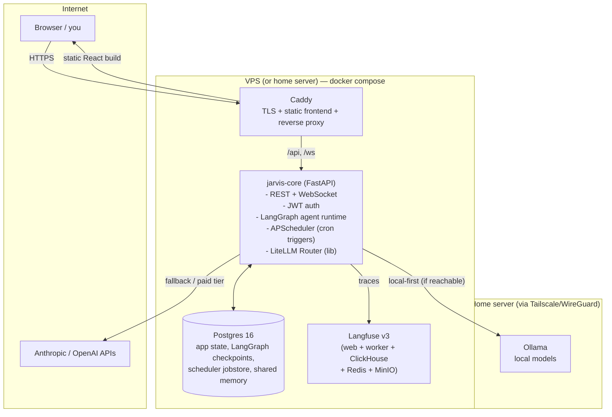

# Jarvis — Architecture Overview (Deliverable 1)

Self-hosted, Dockerized multi-agent environment. One compose stack, portable
between a Hostinger VPS and a home server by moving volumes and repointing DNS.

## 1. Component map

No message bus, no Redis, no Celery. One long-running Python process hosts the
API, the scheduler, and agent execution (as asyncio tasks). That is deliberate:
single user, modest VPS, boring and debuggable. If agent runs ever get heavy
enough to starve the API, the escape hatch is splitting a `jarvis-worker`
container that shares the same codebase and Postgres — a compose change, not a
rearchitecture.

## 2. Containers

| Container | Image / basis | Role | RAM (approx) |
|---|---|---|---|
| `caddy` | caddy:2 (+ built frontend) | TLS (Let's Encrypt), serves React build, proxies `/api` + `/ws` + traces subdomain | ~30 MB |
| `backend` | python:3.12-slim + FastAPI/LangGraph | All agent logic, API, scheduler | 300–600 MB |
| `postgres` | postgres:16-alpine | Single source of durable truth (app DB + Langfuse's relational DB) | 200–400 MB |
| `langfuse-web` | langfuse/langfuse:3 | Tracing UI (decided over Phoenix — see §7) | ~400 MB |
| `langfuse-worker` | langfuse/langfuse-worker:3 | Trace ingestion pipeline | ~300 MB |
| `clickhouse` | clickhouse/clickhouse-server:24.8 | Langfuse trace storage, `mem_limit`-capped | ≤1.5 GB (capped) |
| `redis` | redis:7-alpine | Langfuse queue only — the app itself still doesn't use it | ~50 MB |
| `minio` | minio/minio | Langfuse blob storage (S3-compatible) | ~150 MB |
| `ollama` | ollama/ollama | **Home-server compose profile only** | model-dependent |

Total on the VPS: roughly 3–4 GB under load, which fits the confirmed
**KVM 2 (2 vCPU / 8 GB / 100 GB NVMe)** with headroom. ClickHouse is the one
component that will eat whatever it's given, hence the hard memory cap.

The React frontend is **not** a running container in prod: Vite builds static
assets in a multi-stage Docker build and Caddy serves them. A `docker-compose.dev.yml`
override runs the Vite dev server with HMR for development.

## 3. Where state lives

Everything durable is in **Postgres** — one engine to back up, one volume to
migrate:

| Data | Mechanism |
|---|---|
| Users, sessions | `users` table, JWT auth |
| Agent registry metadata | code-defined (declarative), mirrored to DB for the dashboard |
| Run history, messages, logs per run | `runs`, `run_events` tables |
| Conversation / graph state | LangGraph Postgres checkpointer (`langgraph-checkpoint-postgres`) |
| Scheduled triggers | declared in agent manifests (code), idempotently re-registered with APScheduler at startup — no persisted jobstore to drift |
| Shared cross-agent memory | `memory` table (namespaced key/value + JSONB); pgvector extension reserved for semantic recall later — not in v1 |
| Traces | Langfuse (relational data in shared Postgres, trace events in ClickHouse + MinIO volumes) |
| TLS certs | Caddy volume |

**Postgres over SQLite**, decided: LangGraph's maintained checkpointer targets
Postgres; the scheduler, the API, and concurrent agent runs all write at once
(SQLite's single-writer lock becomes a real problem); and the tracing stack
needs Postgres-class storage anyway. SQLite would save ~200 MB of RAM and cost
us concurrency and the checkpointer — bad trade.

**No Redis in v1.** Nothing needs a queue or cache yet: APScheduler replaces
Celery beat, agent runs are asyncio tasks, WebSocket streaming is in-process.
Redis gets added if and when a genuine queue appears.

## 4. Agent framework (shared, not per-agent)

Three framework-level primitives, all living in `core/` and consumed by every
agent:

1. **BaseAgent pattern** — each agent is a LangGraph graph built from a common
   scaffold: standard state schema (messages, scratchpad, run metadata),
   checkpointing wired in, model access only via the router, structured
   logging + tracing decorators applied uniformly.
2. **Tool registry** — tools are plain Python functions registered with a
   decorator (`@tool(name=..., scopes=[...])`). The registry is global; each
   agent declares which tools (or scopes) it gets. Adding a tool once makes it
   available to any agent. Agents themselves can be registered as tools
   ("agent-as-tool"), which is the sanctioned way agents invoke each other —
   no direct agent-to-agent messaging in v1.
3. **Memory/state services** — a thin `Memory` API (namespaced get/put/search
   over the `memory` table) plus the checkpointer. Agents never open raw DB
   connections.

Scheduling is also framework-level: an agent declares triggers
(`cron="0 7 * * *"`) in its manifest; the scheduler picks them up at startup.
Adding agent #4 = new package under `agents/`, a manifest, and registration —
that's the "adding a new agent" guide (deliverable 8).

## 5. LLM routing

**LiteLLM as a library (Router), not the LiteLLM proxy container.** Same
config-driven model list, fallbacks, and cost tracking, minus ~300 MB and one
more service to secure. If a non-Python consumer ever needs the routing layer,
promoting it to the proxy container is a config move.

**Hardware reality check (decided specs):** the home server is ~2 vCPU /
8 GB like the VPS, presumably CPU-only. That supports **3–8B quantized
models** (llama3.2:3b, qwen2.5:7b-q4, phi-4-mini) at modest speed — good for
bulk/cheap work (summarization, classification, drafts), not for
agent-grade reasoning. The routing tiers reflect that:

- `local-bulk` → Ollama small model → fallback Claude Haiku
- `fast` → Claude Haiku (API)
- `smart` → Claude Sonnet (API, no local fallback)

Ollama reachability is health-checked with a short timeout; unreachable local
= silent fallback to API + a logged event, so the system works identically
when the home server is off.

**VPS → home-server connectivity: Tailscale** (decided). Ollama's port is
reachable only over the tailnet interface, never the public internet.

## 6. Access & security

- **Reverse proxy: Caddy over Traefik.** One readable Caddyfile, automatic
  Let's Encrypt with zero annotations, tiny footprint. Traefik earns its
  complexity when services come and go dynamically; this stack is static.
- **Auth: JWT built into FastAPI** (argon2 password hashing, httponly
  refresh-token cookie, short-lived access tokens). Single `users` table, so
  multi-user later is an INSERT, not a migration. Authelia rejected for v1 —
  another container, its own session store, and real config surface for one
  user. The non-corner-painting escape hatch: Caddy supports `forward_auth`,
  so bolting Authelia/OIDC in front later requires zero app changes.
- WebSocket auth via the same JWT (token on connect).
- Secrets: `.env` (git-ignored) referenced from compose; a `.env.example` is
  committed. Docker secrets are an option but add ceremony without a swarm.
- Langfuse UI at `traces.<domain>` relies on Langfuse's native auth
  (email/password, signup disabled after the bootstrapped admin user). Its
  Postgres/ClickHouse/Redis/MinIO backends are never exposed outside the
  compose network.
- Hardening checklist (delivered with exact commands in deliverable 6): UFW
  (22/80/443 only), SSH key-only + no root login, fail2ban on sshd, Caddy
  rate limiting on `/api/auth/*`, unattended-upgrades, Docker socket never
  mounted into any container.

## 7. Observability

- **Structured logs:** `structlog` → JSON to stdout → `docker logs` /
  `docker compose logs`. No log shipper in v1 (Loki+Grafana is a later,
  optional add).
- **Tracing: self-hosted Langfuse v3** (decided, with the memory cost
  understood). It brings four extra containers (web, worker, ClickHouse,
  Redis, MinIO — Postgres is shared with the app). Mitigations so it behaves
  on an 8 GB box:
  - ClickHouse runs with a hard `mem_limit` (default 1.5 GB) — single-user
    trace volume is tiny, so this is generous.
  - Redis capped at 128 MB (`noeviction`, per Langfuse's requirement).
  - Langfuse's relational data lives in a second database inside the shared
    Postgres instance — no second Postgres container.
  - Trace retention should be pruned periodically (part of the backup/
    maintenance runbook, deliverable 9).
  - If memory pressure ever bites, the whole Langfuse block lifts onto the
    home server unchanged and the backend ships traces over Tailscale.
  - The tracing UI is exposed at `traces.<domain>` behind Langfuse's own
    login, with signup disabled after the initial admin user is bootstrapped.

## 8. Data flow (one agent run, end to end)

1. Trigger: dashboard chat message, REST call, or APScheduler cron firing.
2. `jarvis-core` creates a `run` row, spawns the agent's LangGraph graph as an
   asyncio task with a checkpointer thread id.
3. Graph nodes call tools from the registry and models via the LiteLLM router
   (local-first where configured, API fallback).
4. Every step: checkpoint → Postgres; trace span → Langfuse; structured log →
   stdout; streaming tokens/events → WebSocket → dashboard.
5. Terminal state: run row finalized (status, cost, token counts). Run history
   and full event log are queryable in the dashboard afterwards.

## 9. Portability (VPS ↔ home server)

The whole system is: the repo + one `.env` + named volumes (`postgres_data`,
`caddy_data`, `clickhouse_data`, `minio_data`, `ollama_data`). Migration
(full runbook is deliverable 7):

1. `docker compose down` on source; `pg_dump` + tar the volumes (also the
   ongoing backup strategy, deliverable 9).
2. Restore volumes on target, copy `.env`, `docker compose up -d`.
3. Repoint DNS A record at Papaki; Caddy re-issues certs automatically.
4. Compose profiles handle the hardware difference: `--profile local-llm`
   enables Ollama on the home server; the VPS runs without it and the router
   falls back to APIs.

## 10. Decisions confirmed (2026-07-17)

1. **VPS: Hostinger KVM 2 — 2 vCPU / 8 GB / 100 GB NVMe / 8 TB bandwidth.
   Home server: approximately the same.** Consequence: local models are
   limited to small quantized ones (see §5); the paid APIs remain the
   workhorse for reasoning-heavy agent steps.
2. **Tracing: self-hosted Langfuse v3** on the VPS, memory-capped (§7).
3. **VPS ↔ home tunnel: Tailscale.**
4. **Email: Gmail**, implemented via app-password IMAP (needs 2FA on the
   account; no Google Cloud project). The personal agent is deliberately
   **draft-only**: it saves replies into Gmail Drafts and can never send —
   the human presses Send. Upgrading to the Gmail API/OAuth later only
   changes `tools/gmail.py`.

Still assumed: single domain with `jarvis.` and `traces.` subdomains at
Papaki; timezone Europe/Athens for cron schedules.
